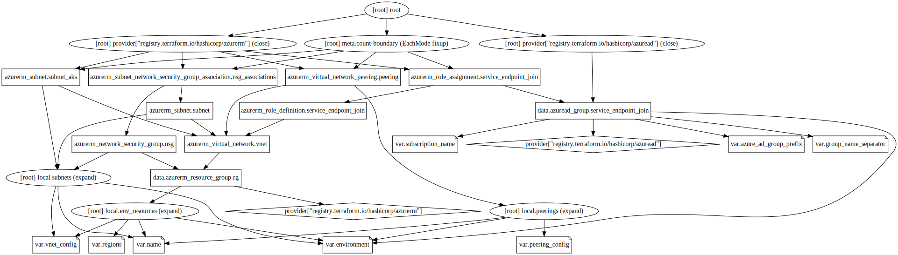

# Core

This module is used to create core resources like virtual network for the subscription.

## Requirements

| Name | Version |
|------|---------|
| terraform | 0.13.5 |
| azuread | 1.0.0 |
| azurerm | 2.35.0 |

## Providers

| Name | Version |
|------|---------|
| azuread | 1.0.0 |
| azurerm | 2.35.0 |

## Inputs

| Name | Description | Type | Default | Required |
|------|-------------|------|---------|:--------:|
| azure\_ad\_group\_prefix | Prefix for Azure AD Groupss | `string` | `"az"` | no |
| environment | The environment name to use for the deploy | `string` | n/a | yes |
| group\_name\_separator | Separator for group names | `string` | `"-"` | no |
| name | The commonName to use for the deploy | `string` | n/a | yes |
| peering\_config | Peering configuration | <pre>map(list(object({     name                         = string     remote_virtual_network_id    = string     allow_forwarded_traffic      = bool     use_remote_gateways          = bool     allow_virtual_network_access = bool   })))</pre> | `{}` | no |
| regions | The Azure Regions to configure | <pre>list(object({     location       = string     location_short = string   }))</pre> | n/a | yes |
| subscription\_name | The subscriptionCommonName to use for the deploy | `string` | n/a | yes |
| vnet\_config | Address spaces used by virtual network. | <pre>map(object({     address_space = list(string)     subnets = list(object({       name              = string       cidr              = string       service_endpoints = list(string)       aks_subnet        = bool     }))   }))</pre> | n/a | yes |

## Outputs

No output.

