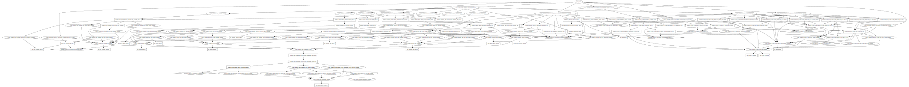

# EKS Core

This module is used to configure EKS clusters.

## Requirements

| Name | Version |
|------|---------|
| terraform | 0.13.5 |
| aws | 3.20.0 |
| flux | 0.0.7 |
| github | 4.1.0 |
| kubectl | 1.9.1 |
| kubernetes | 1.13.3 |
| random | 3.0.0 |

## Providers

| Name | Version |
|------|---------|
| aws | 3.20.0 |
| kubernetes | 1.13.3 |

## Inputs

| Name | Description | Type | Default | Required |
|------|-------------|------|---------|:--------:|
| cert\_manager\_config | Cert Manager configuration | <pre>object({     notification_email = string     dns_zone           = string     role_arn           = string   })</pre> | n/a | yes |
| cert\_manager\_enabled | Should Cert Manager be enabled | `bool` | `true` | no |
| environment | The environment name to use for the deploy | `string` | n/a | yes |
| external\_dns\_config | External DNS configuration | <pre>object({     role_arn = string   })</pre> | n/a | yes |
| external\_dns\_enabled | Should External DNS be enabled | `bool` | `true` | no |
| external\_secrets\_config | External Secrets configuration | <pre>object({     role_arn = string   })</pre> | n/a | yes |
| external\_secrets\_enabled | Should External Secrets be enabled | `bool` | `true` | no |
| fluxcd\_v2\_config | Configuration for fluxcd-v2 | <pre>object({     type = string     github = object({       owner = string     })     azure_devops = object({       pat  = string       org  = string       proj = string     })   })</pre> | n/a | yes |
| fluxcd\_v2\_enabled | Should fluxcd-v2 be enabled | `bool` | `true` | no |
| ingress\_nginx\_enabled | Should Ingress NGINX be enabled | `bool` | `true` | no |
| kubernetes\_network\_policy\_default\_deny | If network policies should by default deny cross namespace traffic | `bool` | `false` | no |
| kyverno\_enabled | Should Kyverno be enabled | `bool` | `true` | no |
| namespaces | The namespaces that should be created in Kubernetes. | <pre>list(     object({       name   = string       labels = map(string)       flux = object({         enabled = bool         github = object({           repo = string         })         azure_devops = object({           org  = string           proj = string           repo = string         })       })     })   )</pre> | n/a | yes |
| opa\_gatekeeper\_enabled | Should OPA Gatekeeper be enabled | `bool` | `true` | no |
| velero\_config | Velero configuration | <pre>object({     role_arn     = string     s3_bucket_id = string   })</pre> | n/a | yes |
| velero\_enabled | Should Velero be enabled | `bool` | `false` | no |

## Outputs

No output.

