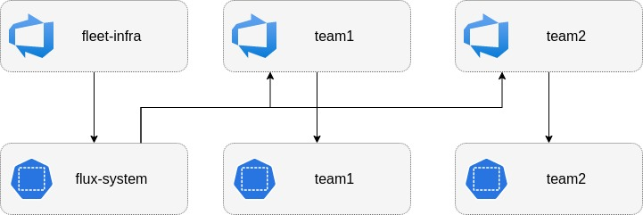

# Flux V2

Installs and configures [flux2](https://github.com/fluxcd/flux2) with GitHub.

The module is meant to offer a full bootstrap and confiugration of a Kubernetes cluster
with Fluxv2. A "root" repository is created for the bootstrap configuration along with a
repository per namepsace passed in the variables. The root repository will receive `cluster-admin`
permissions in the cluster while each of the namespace repositories will be limited to their
repsective namespace. The CRDs, component deployments and bootstrap configuration are both
added to the Kubernetes cluster and commited to the root repository. While the namespace
configuration is only comitted to the root repository and expected to be reconciled through
the bootstrap configuration.

## Requirements

| Name | Version |
|------|---------|
|  [terraform](#requirement\_terraform) | >= 1.3.0 |
|  [flux](#requirement\_flux) | 0.25.3 |
|  [github](#requirement\_github) | 5.34.0 |
|  [helm](#requirement\_helm) | 2.11.0 |
|  [kubectl](#requirement\_kubectl) | 1.14.0 |
|  [kubernetes](#requirement\_kubernetes) | 2.23.0 |

## Providers

| Name | Version |
|------|---------|
|  [flux](#provider\_flux) | 0.25.3 |
|  [github](#provider\_github) | 5.34.0 |
|  [helm](#provider\_helm) | 2.11.0 |
|  [kubectl](#provider\_kubectl) | 1.14.0 |
|  [kubernetes](#provider\_kubernetes) | 2.23.0 |

## Modules

No modules.

## Resources

| Name | Type |
|------|------|
| [github_repository_file.cluster_tenants](https://registry.terraform.io/providers/integrations/github/5.34.0/docs/resources/repository_file) | resource |
| [github_repository_file.install](https://registry.terraform.io/providers/integrations/github/5.34.0/docs/resources/repository_file) | resource |
| [github_repository_file.kustomize](https://registry.terraform.io/providers/integrations/github/5.34.0/docs/resources/repository_file) | resource |
| [github_repository_file.sync](https://registry.terraform.io/providers/integrations/github/5.34.0/docs/resources/repository_file) | resource |
| [github_repository_file.tenant](https://registry.terraform.io/providers/integrations/github/5.34.0/docs/resources/repository_file) | resource |
| [helm_release.git_auth_proxy](https://registry.terraform.io/providers/hashicorp/helm/2.11.0/docs/resources/release) | resource |
| [kubectl_manifest.install](https://registry.terraform.io/providers/gavinbunney/kubectl/1.14.0/docs/resources/manifest) | resource |
| [kubectl_manifest.sync](https://registry.terraform.io/providers/gavinbunney/kubectl/1.14.0/docs/resources/manifest) | resource |
| [kubernetes_namespace.this](https://registry.terraform.io/providers/hashicorp/kubernetes/2.23.0/docs/resources/namespace) | resource |
| [flux_install.this](https://registry.terraform.io/providers/fluxcd/flux/0.25.3/docs/data-sources/install) | data source |
| [flux_sync.this](https://registry.terraform.io/providers/fluxcd/flux/0.25.3/docs/data-sources/sync) | data source |
| [github_repository.cluster](https://registry.terraform.io/providers/integrations/github/5.34.0/docs/data-sources/repository) | data source |
| [kubectl_file_documents.install](https://registry.terraform.io/providers/gavinbunney/kubectl/1.14.0/docs/data-sources/file_documents) | data source |
| [kubectl_file_documents.sync](https://registry.terraform.io/providers/gavinbunney/kubectl/1.14.0/docs/data-sources/file_documents) | data source |

## Inputs

| Name | Description | Type | Default | Required |
|------|-------------|------|---------|:--------:|
|  [branch](#input\_branch) | Branch to point source controller towards | `string` | `"main"` | no |
|  [cluster\_id](#input\_cluster\_id) | Environment name of the cluster | `string` | n/a | yes |
|  [cluster\_repo](#input\_cluster\_repo) | Name of cluster repository | `string` | `"xks-fleet-infra"` | no |
|  [environment](#input\_environment) | Environment name of the cluster | `string` | n/a | yes |
|  [github\_app\_id](#input\_github\_app\_id) | ID of GitHub Application used by Git Auth Proxy | `number` | n/a | yes |
|  [github\_installation\_id](#input\_github\_installation\_id) | Installation ID of GitHub Application used by Git Auth Proxy | `number` | n/a | yes |
|  [github\_org](#input\_github\_org) | Org of GitHub repositories | `string` | n/a | yes |
|  [github\_private\_key](#input\_github\_private\_key) | Private Key for GitHub Application used by Git Auth Proxy | `string` | n/a | yes |
|  [namespaces](#input\_namespaces) | The namespaces to configure flux with | <pre>list(     object({       name = string       flux = object({         enabled = bool         repo    = string       })     })   )</pre> | n/a | yes |
|  [slack\_flux\_alert\_webhook](#input\_slack\_flux\_alert\_webhook) | A webhook address for sending alerts to slack | `string` | `"main"` | no |

## Outputs

No outputs.
