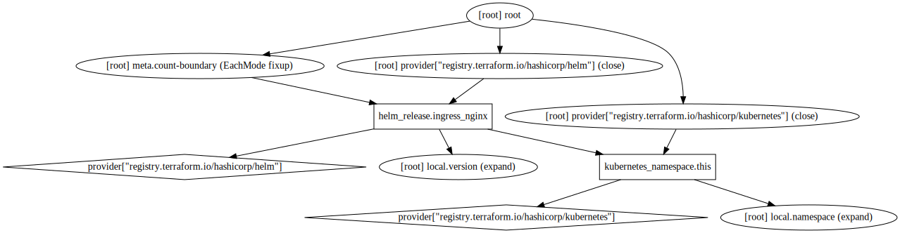

# Ingress NGINX (ingress-nginx)

This module is used to add [`ingress-nginx`](https://github.com/kubernetes/ingress-nginx) to Kubernetes clusters.

## Requirements

| Name | Version |
|------|---------|
| terraform | 0.13.5 |
| helm | 1.3.2 |
| kubernetes | 1.13.3 |

## Providers

| Name | Version |
|------|---------|
| helm | 1.3.2 |
| kubernetes | 1.13.3 |

## Inputs

No input.

## Outputs

No output.

