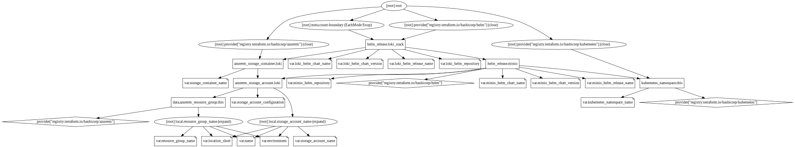

# Grafana Loki

This module is used to add [`loki`](https://github.com/grafana/loki) to Kubernetes clusters (tested with AKS).

## Details

This module will also add `minio` (S3 Gateway to Azure Storage Account), `fluent-bit` and `grafana`.

## Requirements

| Name | Version |
|------|---------|
| terraform | 0.13.5 |
| azurerm | 2.35.0 |
| helm | 1.3.2 |
| kubernetes | 1.13.3 |

## Providers

| Name | Version |
|------|---------|
| azurerm | 2.35.0 |
| helm | 1.3.2 |
| kubernetes | 1.13.3 |

## Inputs

| Name | Description | Type | Default | Required |
|------|-------------|------|---------|:--------:|
| environment | The environment (short name) to use for the deploy | `string` | n/a | yes |
| kubernetes\_namespace\_name | The Kubernetes namespace name | `string` | `"loki"` | no |
| location\_short | The Azure region short name. | `string` | n/a | yes |
| loki\_helm\_chart\_name | The helm chart name for loki | `string` | `"loki-stack"` | no |
| loki\_helm\_chart\_version | The helm chart version for loki | `string` | `"2.0.0"` | no |
| loki\_helm\_release\_name | The helm release name for loki | `string` | `"loki"` | no |
| loki\_helm\_repository | The helm repository for loki | `string` | `"https://grafana.github.io/loki/charts"` | no |
| minio\_helm\_chart\_name | The helm chart name for minio | `string` | `"minio"` | no |
| minio\_helm\_chart\_version | The helm chart version for minio | `string` | `"8.0.0"` | no |
| minio\_helm\_release\_name | The helm release name for minio | `string` | `"loki-minio"` | no |
| minio\_helm\_repository | The helm repository for minio | `string` | `"https://helm.min.io/"` | no |
| name | The name to use for the deploy | `string` | n/a | yes |
| resource\_group\_name | The resource group name | `string` | `""` | no |
| storage\_account\_configuration | The storage account configuration | <pre>object({     account_tier             = string     account_replication_type = string     account_kind             = string   })</pre> | <pre>{   "account_kind": "StorageV2",   "account_replication_type": "GRS",   "account_tier": "Standard" }</pre> | no |
| storage\_account\_name | The storage account name | `string` | `""` | no |
| storage\_container\_name | The storage container name | `string` | `"loki"` | no |

## Outputs

No output.

